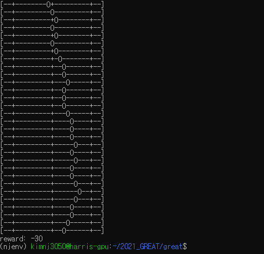
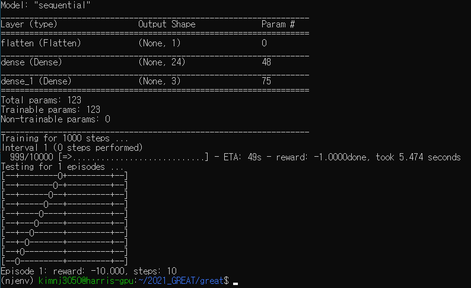

# 2021_GREAT
## Simulation of Cyberattacks on Industrial IoT Systems
- Faculty Mentors: Ian Harris

## Tasks
1. Create new environment using openai-gym
1. Implement a random agent
1. Apply reinforcement learning to the agent

## Captures
### Random Agent
- Maximum iterations of each episode == 30
- The reward decreases at every step

### DQN Agent

